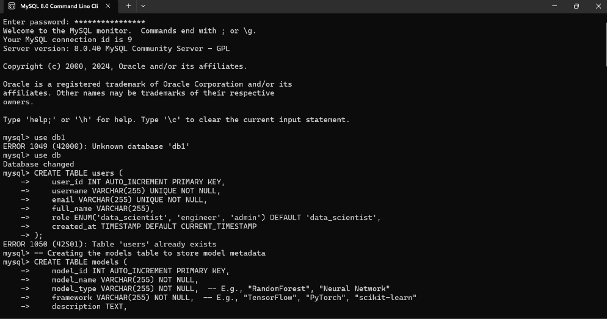
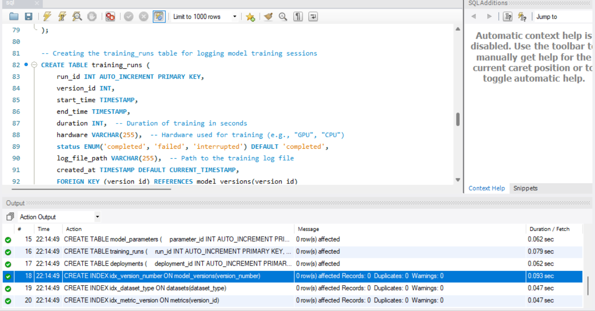

# ML Model Metadata management using MySQL

## Introduction:
- ML model metadata management refers to the systematic process of organising, tracking and storing metadata associated with ML models.
- • As machine learning becomes increasingly integral to various applications, effective metadata management is essential for ensuring the quality, reproducibility, and governance of machine learning processes.
 
## Tech-Stack Used:
- MySQL

- 
## Output Screenshots:

